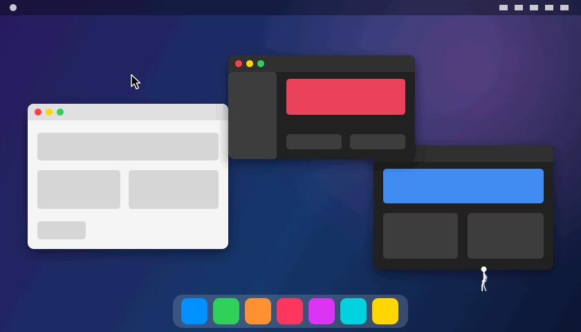

# Stick Chase



A stick figure that lives on your Mac's screen and parkours across windows, buttons, icons and
panels trying to catch your mouse cursor. Once he has it he hangs off it or rides on top; shake the
mouse to fling him off.

## Build and run

```bash
./build.sh
open "Stick Chase.app"
```

Requires macOS 13+ and the Xcode command line tools. The build signs with an Apple Development
identity if one is installed (so the Screen Recording permission survives rebuilds), otherwise ad-hoc.

## Screen vision

With Screen Recording permission he treats edges found in the screen image as ledges and walls.
Without it he only uses window frames. Click the Dock icon to open the controls, choose "Enable…" next to Screen vision, allow it in
System Settings, then click "Restart". Captured frames are only used for edge detection and never saved.

To quit, right-click the Dock icon and choose Quit (or use the Quit button in the controls).

## Dev tools

```bash
build/StickChase --selftest                 # planner timing + headless 8-minute chase
build/StickChase --snapshot poses.png       # pose sheet
build/StickChase --film film.png [--alt]    # contact sheet of a simulated chase
build/StickChase --vision-test in.png out.png   # edge detection on a screenshot
build/StickChase --stress a.png b.png       # 6-minute chases over screenshot edges: loops, stalls, falls
build/StickChase --spin-test                # swing him in circles and report turns / letting go
build/StickChase --demo-gif docs/demo.gif   # the README demo: the real engine in a staged scene
STICKCHASE_LOG=1 "Stick Chase.app/Contents/MacOS/StickChase"   # log state twice a second
```

## License

MIT. See [LICENSE](LICENSE).
